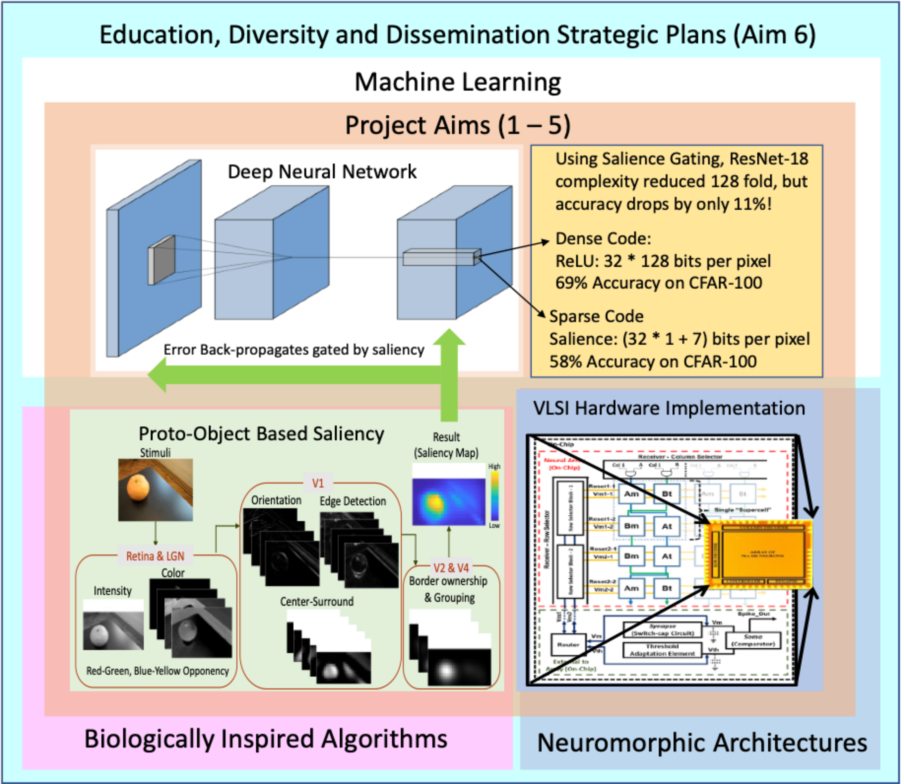

**EFRI BRAID: Using Proto-Object Based Saliency Inspired by Cortical Local Circuits to Limit the Hypothesis Space for Deep Learning Models**

The object of this project is to use the biologically plausible [proto-object saliency](https://doi.org/10.1016/j.visres.2013.10.005) for sparsifying connectivity in Deep Neural Networks to ultimately achieve parsimonious yet efficient training and inference compute.

<!-- <a href="url", style>link text</a> -->

<p style="text-align: center;"> <a href="./team.html">[See the Team]</a> </p>

<!--  -->
![][./assets/img/BRAID_Aims.png]

**Project Abstract** <br>
Deep learning has achieved impressive performance in many tasks, which is driven by the capacity for backpropagation to “assign credit” to a vast array of parameters. Typical networks have immensely complex computational graphs, with many options to assign credit for every computation. A large number of options comes with the benefits of being very flexible in learning, but also with costs of large energy consumption and many needed examples for learning. A selection of important (salient) features will cause inductive biases in learning, but such biases, when appropriately conditioned, can be optimally selected, as is done in biology via evolution or development. For our project, the selection mechanism will be inspired by biology (Aims 1&2) or learned (Aims 3&4), and will be instantiated in software and hardware.
The process of selection is akin to the attention mechanisms of mammals. We previously developed state-of-the art models, based on neurophysiology, of bottom-up and top-down attention and suggested how perceptual organization can reshape and focus attention. We showed how such mechanisms of attention which can predict human behaviors can be implemented using local circuits in the cortex and in neuromorphic hardware.
We propose to construct a hybrid architecture, where local circuits implement a bottom-up attention, or saliency module that provides a “gate” for selecting features for a global learning network with a convolutional architecture. The saliency module will decrease the number of features considered for inference and for learning by including a learned prior of what features are important. We hypothesize that after determining and implementing optimal attentional mechanisms for a set of tasks/input statistics, they will substantially reduce power requirement for both inference and learning, as well as allowing learning with considerably fewer examples than traditional methods.
Such a model can also help answer the question of why some visual cortex neurons have their properties explained by convolutional neural networks while others mimic saliency models, and why biology learns with few examples. We can also answer determine optimal learning architecture for hardware and benchmark them against existing systems.

**References**

1. Steinmetz, P. N. et al. Attention modulates synchronized neuronal firing in primate somatosensory cortex. Nature 404, 187–190 (2000).
2. Russell, A. et al. Optimization methods for spiking neurons and networks. IEEE Trans. Neural Netw. 21, 1950–1962 (2010).
3. Molin, J. L., Etienne-Cummings, R. & Niebur, E. How is motion integrated into a proto-object based visual saliency model? in 2015 49th Annual Conference on Information Sciences and Systems (CISS) 1–6 (2015).
4. Thakur, C. S. et al. Neuromorphic visual saliency implementation using stochastic computation. in 2017 IEEE International Symposium on Circuits and Systems (ISCAS) 1–4 (2017).
5. Molin, J. L., Russell, A. F., Mihalas, S., Niebur, E. & Etienne-Cummings, R. Proto-object based visual saliency model with a motion-sensitive channel. 2013 IEEE Biomedical Circuits and Systems Conference (BioCAS) (2013) doi:10.1109/biocas.2013.6679631.
6. Uejima, T., Niebur, E. & Etienne-Cummings, R. Proto-Object Based Saliency Model With Texture Detection Channel. Front. Comput. Neurosci. 14, 541581 (2020).
7. Uejima, T., Niebur, E. & Etienne-Cummings, R. Proto-Object Based Saliency Model with Second- Order Texture Feature. in 2018 IEEE Biomedical Circuits and Systems Conference (BioCAS) 1–4 (2018).
8. Mancinelli, E., Niebur, E. & Etienne-Cummings, R. Computational stereo-vision model of proto-object based saliency in three-dimensional space. in 2018 IEEE Biomedical Circuits and Systems Conference (BioCAS) 1–4 (2018).
9. Hu, B., von der Heydt, R. & Niebur, E. Figure-Ground Organization in Natural Scenes: Performance of a Recurrent Neural Model Compared with Neurons of Area V2. eNeuro 6, (2019).
10. Jeck, D. M., Qin, M., Egeth, H. & Niebur, E. Unique objects attract attention even when faint. Vision Res. 160, 60–71 (2019).
11. Hu, B., Khan, S., Niebur, E. & Tripp, B. Figure-ground representation in deep neural networks. in 2019 53rd Annual Conference on Information Sciences and Systems (CISS) 1–6 (2019).
12. Hu, B. & Niebur, E. A recurrent neural model for proto-object based contour integration and figure- ground segregation. J. Comput. Neurosci. 43, 227–242 (2017).
13. Hu, B., Kane-Jackson, R. & Niebur, E. A proto-object based saliency model in three-dimensional space. Vision Res. 119, 42–49 (2016).
14. Hu, B., von der Heydt, R. & Niebur, E. A neural model for perceptual organization of 3D surfaces. in 2015 49th Annual Conference on Information Sciences and Systems (CISS) 1–3 (2015).
15. Niebur, E., Hsiao, S. S. & Johnson, K. O. Synchrony: a neuronal mechanism for attentional selection? Curr. Opin. Neurobiol. 12, 190–194 (2002).
16. Parkhurst, D., Law, K. & Niebur, E. Modeling the role of salience in the allocation of overt visual attention. Vision Res. 42, 107–123 (2002).
17. Niebur, E. Electrophysiological correlates of synchronous neural activity and attention: a short review. Biosystems. 67, 157–166 (2002).
18. Parkhurst, D. & Niebur, E. Scene content selected by active vision. Spatial Vision vol. 16 125–154 (2003).
19. Parkhurst, D. J. & Niebur, E. Texture contrast attracts overt visual attention in natural scenes. European Journal of Neuroscience vol. 19 783–789 (2004).
20. Niebur, E. Temporal tagging of attended objects. Proceedings of the National Academy of Sciences vol. 106 2479–2480 (2009).
21. Mihalas, S., von der Heydt, R. & Niebur, E. A network model of multiplicative attentional modulation. in 2012 46th Annual Conference on Information Sciences and Systems (CISS) 1–4 (2012).
22. Chen, X., Mihalas, S., Niebur, E. & Stuphorn, V. Mechanisms underlying the influence of saliency on value-based decisions. J. Vis. 13, (2013).
23. Le Callet, P. & Niebur, E. Visual Attention and Applications in Multimedia Technologies. Proc. IEEE Inst. Electr. Electron. Eng. 101, 2058–2067 (2013).
24. Masciocchi, C. M., Mihalas, S., Parkhurst, D. & Niebur, E. Everyone knows what is interesting: Salient locations which should be fixated. Journal of Vision vol. 9 25–25 (2009).
25. Gomez-Ramirez, M., Hysaj, K. & Niebur, E. Neural mechanisms of selective attention in the somatosensory system. J. Neurophysiol. 116, 1218–1231 (2016).
26. Jeck, D. M., Qin, M., Egeth, H. & Niebur, E. Attentive pointing in natural scenes correlates with other measures of attention. Vision Res. 135, 54–64 (2017).
27. Itti, L., Koch, C. & Niebur, E. A model of saliency-based visual attention for rapid scene analysis. IEEE Trans. Pattern Anal. Mach. Intell. 20, 1254–1259 (1998).
28. Usher, M. & Niebur, E. Modeling the Temporal Dynamics of IT Neurons in Visual Search: A Mechanism for Top-Down Selective Attention. J. Cogn. Neurosci. 8, 311–327 (1996).
29. Fan, X. et al. Overt visual attention and value computation in complex risky choice. bioRxiv 2020.12.08.416313 (2020) doi:10.1101/2020.12.08.416313.
30. Wagatsuma, N., Hu, B., von der Heydt, R. & Niebur, E. Analysis of spiking synchrony in visual cortex reveals distinct types of top-down modulation signals for spatial and object-based attention. PLoS Comput. Biol. 17, e1008829 (2021).
31. Chang, S., Niebur, E. & Egeth, H. E. Standing out in a small crowd: The role of display size in attracting attention. Vis. cogn. 29, 587–591 (2021).
32. Mihalas, S., Dong, Y., von der Heydt, R. & Niebur, E. Mechanisms of perceptual organization provide auto-zoom and auto-localization for attention to objects. Proceedings of the National Academy of Sciences 108, 7583–7588 (2011).
33. Molin, J. L. et al. Low-power, low-mismatch, highly-dense array of VLSI Mihalas-Niebur neurons. in 2017 IEEE International Symposium on Circuits and Systems (ISCAS) 1–4 (2017).
34. Folowosele, F., Hamilton, T. J. & Etienne-Cummings, R. Silicon Modeling of the Mihalaş–Niebur Neuron. IEEE Trans. Neural Netw. 22, 1915–1927 (2011).
35. Niebur, E. & Koch, C. Control of Selective Visual Attention: Modeling the “Where” Pathway. Adv. Neural Inf. Process. Syst. 8, (1995).
36. Russell, A. F., Mihalaş, S., von der Heydt, R., Niebur, E. & Etienne-Cummings, R. A model of proto- object based saliency. Vision Res. 94, (2014).
37. Chokshi, V. et al. Naturalistic Spike Trains Drive State-Dependent Homeostatic Plasticity in Superficial Layers of Visual Cortex. Front. Synaptic Neurosci. 13, 663282 (2021).
38. Molin, J., Thakur, C., Niebur, E. & Etienne-Cummings, R. A Neuromorphic Proto-Object Based Dynamic Visual Saliency Model With a Hybrid FPGA Implementation. IEEE Trans. Biomed. Circuits Syst. 15, 580–594 (2021).
39. Gillary, G., Heydt, R. von der & Niebur, E. Short-term depression and transient memory in sensory cortex. J. Comput. Neurosci. 43, 273–294 (2017).
40. Gillary, G. & Niebur, E. The Edge of Stability: Response Times and Delta Oscillations in Balanced Networks. PLoS Comput. Biol. 12, e1005121 (2016).
41. Glickman, M. et al. The formation of preference in risky choice. PLoS Comput. Biol. 15, e1007201 (2019).
42. Wang, J., Niebur, E., Hu, J. & Li, X. Suppressing epileptic activity in a neural mass model using a closed-loop proportional-integral controller. Sci. Rep. 6, 27344 (2016).
43. Wagatsuma, N., von der Heydt, R. & Niebur, E. Spike synchrony generated by modulatory common input through NMDA-type synapses. J. Neurophysiol. 116, 1418–1433 (2016).
44. Ray, S., Niebur, E., Hsiao, S. S., Sinai, A. & Crone, N. E. High-frequency gamma activity (80--150 Hz) is increased in human cortex during selective attention. Clin. Neurophysiol. 119, 116–133 (2008).
45. Craft, E., Schütze, H., Niebur, E. & von der Heydt, R. A Neural Model of Figure–Ground Organization. J. Neurophysiol. 97, 4310–4326 (2007).
46. Niebur, E., Schuster, H. G. & Kammen, D. M. Collective frequencies and metastability in networks of limit-cycle oscillators with time delay. Phys. Rev. Lett. 67, 2753–2756 (1991).
47. Ray, S., Crone, N. E., Niebur, E., Franaszczuk, P. J. & Hsiao, S. S. Neural Correlates of High- Gamma Oscillations (60–200 Hz) in Macaque Local Field Potentials and Their Potential Implications in Electrocorticography. J. Neurosci. 28, 11526–11536 (2008).
48. Ramenahalli, S., Mihalas, S. & Niebur, E. Figure-ground classification based on spectral properties of boundary image patches. 2012 46th Annual Conference on Information Sciences and Systems (CISS) (2012) doi:10.1109/ciss.2012.6310943.
49. Mihalas, S., Dong, Y., von der Heydt, R. & Niebur, E. Event-related simulation of neural processing in complex visual scenes. 2011 45th Annual Conference on Information Sciences and Systems (2011) doi:10.1109/ciss.2011.5766209.
50. Hu, B., von der Heydt, R. & Niebur, E. A neural model for perceptual organization of 3D surfaces. 2015 49th Annual Conference on Information Sciences and Systems (CISS) (2015) doi:10.1109/ciss.2015.7086906.
51. Mihalas, S., von der Heydt, R. & Niebur, E. A network model of multiplicative attentional modulation. 2012 46th Annual Conference on Information Sciences and Systems (CISS) (2012) doi:10.1109/ciss.2012.6310948.
52. Ardila, D., Mihalas, S., von der Heydt, R. & Niebur, E. Medial axis generation in a model of
perceptual organization. in 2012 46th Annual Conference on Information Sciences and Systems (CISS) 1–4 (2012).
53. Ramenahalli, S. et al. Audio-visual saliency map: Overview, basic models and hardware implementation. in 2013 47th Annual Conference on Information Sciences and Systems (CISS) 1–6 (2013).
54. Ramenahalli, S. & Niebur, E. Computing 3D saliency from a 2D image. 2013 47th Annual Conference on Information Sciences and Systems (CISS) (2013) doi:10.1109/ciss.2013.6552297.
55. Xu, Y., Zhang, C.-H., Niebur, E. & Wang, J.-S. Analytically determining frequency and amplitude of spontaneous alpha oscillation in Jansen’s neural mass model using the describing function method. Chin. Physics B 27, (2018).
56. Goodfellow, I., Bengio, Y., Courville, A. & Bengio, Y. Deep learning. vol. 1 (MIT press Cambridge, 2016).
57. García-Martín, E., Rodrigues, C. F., Riley, G. & Grahn, H. Estimation of energy consumption in machine learning. J. Parallel Distrib. Comput. 134, 75–88 (2019).
58. Knudsen, E. I. Neural Circuits That Mediate Selective Attention: A Comparative Perspective. Trends Neurosci. 41, 789–805 (2018).
59. Vaswani, A. et al. Attention is all you need. in Advances in neural information processing systems 5998–6008 (2017).
60. Russell, A. & Etienne-Cummings, R. Perceptual organization, attention and object recognition: Closing the loop. in 2012 46th Annual Conference on Information Sciences and Systems (CISS) 1–6
(2012).
61. Thakur, C. S. et al. Large-Scale Neuromorphic Spiking Array Processors: A Quest to Mimic the Brain. Front. Neurosci. 12, 891 (2018).
62. Folowosele, F., Vogelstein, R. J. & Etienne-Cummings, R. Towards a Cortical Prosthesis: Implementing A Spike-Based HMAX Model of Visual Object Recognition in Silico. IEEE Journal on Emerging and Selected Topics in Circuits and Systems 1, 516–525 (2011).
63. Indiveri, G. et al. Neuromorphic silicon neuron circuits. Front. Neurosci. 5, 73 (2011).
64. Vogelstein, R. J., Mallik, U., Culurciello, E., Cauwenberghs, G. & Etienne-Cummings, R. A multichip neuromorphic system for spike-based visual information processing. Neural Comput. 19, 2281–2300 (2007).
65. Van der Spiegel, J. et al. An analog neural computer with modular architecture for real-time dynamic computations. IEEE J. Solid-State Circuits 27, 82–92 (1992).
66. Sengupta, J. P., Villemur, M., Mendat, D. R., Tognetti, G. & Andreou, A. G. Architecture and Algorithm Co-Design Framework for Embedded Processors in Event-Based Cameras. in 2021 IEEE
International Symposium on Circuits and Systems (ISCAS) 1–5 (2021).
67. Sanni, K. A. & Andreou, A. G. A Historical Perspective on Hardware AI Inference, Charge-Based
Computational Circuits and an 8 bit Charge-Based Multiply-Add Core in 16 nm FinFET CMOS. IEEE Journal on Emerging and Selected Topics in Circuits and Systems 9, 532–543 (2019).
68. Evci, U., Ioannou, Y. A., Keskin, C. & Dauphin, Y. Gradient Flow in Sparse Neural Networks and How Lottery Tickets Win. arXiv [cs.LG] (2020).
69. Brix, C., Bahar, P. & Ney, H. Successfully Applying the Stabilized Lottery Ticket Hypothesis to the Transformer Architecture. arXiv [cs.LG] (2020).
70. Hunter, K. L., Spracklen, L. & Ahmad, S. Two Sparsities Are Better Than One: Unlocking the Performance Benefits of Sparse-Sparse Networks. arXiv [cs.LG] (2021).
71. Amodei, D. et al. AI and Compute. Heruntergeladen von https://blog.openai.com/aiand-compute (2018).
72. Thompson, N. C., Greenewald, K., Lee, K. & Manso, G. F. The Computational Limits of Deep Learning. arXiv [cs.LG] (2020).
73. Mead, C. How we created neuromorphic engineering. Nature Electronics 3, 434–435 (2020).
74. Davies, M. et al. Loihi: A Neuromorphic Manycore Processor with On-Chip Learning. IEEE Micro 38,
82–99 (2018).
75. Merolla, P. A. et al. Artificial brains. A million spiking-neuron integrated circuit with a scalable communication network and interface. Science 345, 668–673 (2014).
76. Chun, M. M. & Turk-Browne, N. B. Interactions between attention and memory. Curr. Opin. Neurobiol. 17, 177–184 (2007).
77. James, W. The principles of psychology, Vol I. (1890) doi:10.1037/10538-000.
78. Zhang, X., Zhaoping, L., Zhou, T. & Fang, F. Neural Activities in V1 Create a Bottom-Up Saliency Map. Neuron vol. 73 183–192 (2012).
79. Krabbe, S. et al. Adaptive disinhibitory gating by VIP interneurons permits associative learning. bioRxiv (2018) doi:10.1101/443614.
80. Turi, G. F. et al. Vasoactive Intestinal Polypeptide-Expressing Interneurons in the Hippocampus Support Goal-Oriented Spatial Learning. Neuron 101, 1150-1165.e8 (2019).
81. He, K., Zhang, X., Ren, S. & Sun, J. Deep residual learning for image recognition. in Proceedings of the IEEE conference on computer vision and pattern recognition 770–778 (2016).
82. Hurley, N. & Rickard, S. Comparing Measures of Sparsity. IEEE Trans. Inf. Theory 55, 4723–4741 (2009).
83. Gomez, A. N., Zhang, I., Swersky, K., Gal, Y. & Hinton, G. E. Targeted Dropout. (2018).
84. Andreou, A. G. et al. Bio-inspired system architecture for energy efficient, BIGDATA computing with application to wide area motion imagery. in 2016 IEEE 7th Latin American Symposium on Circuits Systems (LASCAS) 1–6 (2016).
85. Figliolia, T. 2.5D chiplet architecture for embedded processing of high velocity streaming data. (Johns Hopkins University, 2018).
86. Orchard, G., Martin, J. G., Jacob Vogelstein, R. & Etienne-Cummings, R. Fast Neuromimetic Object Recognition Using FPGA Outperforms GPU Implementations. IEEE Transactions on Neural Networks and Learning Systems vol. 24 1239–1252 (2013).
87. Riesenhuber, M. & Poggio, T. Hierarchical models of object recognition in cortex. Nature Neuroscience vol. 2 1019–1025 (1999).
88. LeCun, Y., Kavukcuoglu, K. & Farabet, C. Convolutional networks and applications in vision. Proceedings of 2010 IEEE International Symposium on Circuits and Systems (2010) doi:10.1109/iscas.2010.5537907.
89. Farabet, C. et al. Hardware accelerated convolutional neural networks for synthetic vision systems. in Proceedings of 2010 IEEE International Symposium on Circuits and Systems 257–260 (2010).
90. Serre, T., Wolf, L., Bileschi, S., Riesenhuber, M. & Poggio, T. Robust object recognition with cortex-like mechanisms. IEEE Trans. Pattern Anal. Mach. Intell. 29, 411–426 (2007).
91. Harel, J., Koch, C. & Perona, P. Graph-Based Visual Saliency. Adv. Neural Inf. Process. Syst. 19, (2006).
92. Zamir, A. et al. Taskonomy: Disentangling task transfer learning. in IJCAI International Joint Conference on Artificial Intelligence vols. 2019-August 6241–6245 (International Joint Conferences on Artificial Intelligence, 2019).
93. Madry, A., Makelov, A., Schmidt, L., Tsipras, D. & Vladu, A. Towards Deep Learning Models Resistant to Adversarial Attacks. arXiv [stat.ML] (2017).
94. Samek, W., Wiegand, T. & Müller, K.-R. Explainable Artificial Intelligence: Understanding, Visualizing and Interpreting Deep Learning Models. arXiv [cs.AI] (2017).
95. Hendrycks, D. et al. The many faces of robustness: A critical analysis of out-of-distribution generalization. in Proceedings of the IEEE/CVF International Conference on Computer Vision 8340–8349 (2021).
96. Yamins, D. L. K. & DiCarlo, J. J. Using goal-driven deep learning models to understand sensory cortex. Nat. Neurosci. 19, 356–365 (2016).
97. Jamal Molin*, Kayode Sanni*, Sergio Montano*, Gaspar Tognetti#, Martin Villemur#, Jonah Sengupta#, Daniel Mendat#, Philippe Pouliquen#, Andreas Andreou#, Isidoros Doxas*, Nishant Zachariah*, G. Edge Super Compute – A System-on-Chip for High Performance Edge Computing, GOMAC (2022).
98. Zenke, F. & Vogels, T. P. The remarkable robustness of surrogate gradient learning for instilling complex function in spiking neural networks. bioRxiv 2020.06.29.176925 (2020) doi:10.1101/2020.06.29.176925.
99. Ren, P. et al. A Comprehensive Survey of Neural Architecture Search: Challenges and Solutions. arXiv [cs.LG] (2020).
100. Jaafra, Y., Luc Laurent, J., Deruyver, A. & Saber Naceur, M. Reinforcement learning for neural architecture search: A review. Image Vis. Comput. 89, 57–66 (2019).
101. Baymurzina, D., Golikov, E. & Burtsev, M. A review of neural architecture search. Neurocomputing vol. 474 82–93 (2022).
102. Lemke, C., Budka, M. & Gabrys, B. Metalearning: a survey of trends and technologies. Artif Intell Rev 44, 117–130 (2015).
103. Aboumerhi, K., Etienne-Cummings, R., Sengputa, J. & Rattray, J. Hand-Crafted and Learned Spatiotemporal Filters to Inform and Track Visual Saliency. in 2021 5th International Conference on Intelligent Systems, Metaheuristics & Swarm Intelligence 44–48 (Association for Computing Machinery, 2021).
104. Vivien Thomas Scholars Initiative, https://provost.jhu.edu/about/vivien-thomas-scholars-initiative/
105. nMNIST, https://www.garrickorchard.com/datasets/n-mnist
106. EMNIST, https://www.nist.gov/itl/products-and-services/emnist-dataset
107. Baltimore Scholars, https://apply.jhu.edu/baltimore-scholars-program/
108. Nation, Seychelles Newspaper, “First Global Robotics Challenge,” Seychelles Nation 12th November 2021 Edition, (https://www.nation.sc/articles/11308/first-global-robotic-challenge), (2021).
109. Johns Hopkins Summer Jobs Program, https://www.hopkinsmedicine.org/human_ resources/education_programs/youth/summer_jobs.html
110. NSF Online Ethics Center for Sci. & Eng., www.onlineethics.org/
111. “JHU Researchers Begin to Tackle Bias in Al Used in Disease Diagnosis and Health Care,”
https://www.jhuapl.edu/PressRelease/200218, (2020).


<!-- 
Text can be **bold**, _italic_, or ~~strikethrough~~.

[Link to another page](./another-page.html).

There should be whitespace between paragraphs.

There should be whitespace between paragraphs. We recommend including a README, or a file with information about your project.

# Header 1

This is a normal paragraph following a header. GitHub is a code hosting platform for version control and collaboration. It lets you and others work together on projects from anywhere.

## Header 2

> This is a blockquote following a header.
>
> When something is important enough, you do it even if the odds are not in your favor.

### Header 3

```js
// Javascript code with syntax highlighting.
var fun = function lang(l) {
  dateformat.i18n = require('./lang/' + l)
  return true;
}
```

```ruby
# Ruby code with syntax highlighting
GitHubPages::Dependencies.gems.each do |gem, version|
  s.add_dependency(gem, "= #{version}")
end
```

#### Header 4

*   This is an unordered list following a header.
*   This is an unordered list following a header.
*   This is an unordered list following a header.

##### Header 5

1.  This is an ordered list following a header.
2.  This is an ordered list following a header.
3.  This is an ordered list following a header.

###### Header 6

| head1        | head two          | three |
|:-------------|:------------------|:------|
| ok           | good swedish fish | nice  |
| out of stock | good and plenty   | nice  |
| ok           | good `oreos`      | hmm   |
| ok           | good `zoute` drop | yumm  |

### There's a horizontal rule below this.

* * *

### Here is an unordered list:

*   Item foo
*   Item bar
*   Item baz
*   Item zip

### And an ordered list:

1.  Item one
1.  Item two
1.  Item three
1.  Item four

### And a nested list:

- level 1 item
  - level 2 item
  - level 2 item
    - level 3 item
    - level 3 item
- level 1 item
  - level 2 item
  - level 2 item
  - level 2 item
- level 1 item
  - level 2 item
  - level 2 item
- level 1 item

### Small image


### Large image


### Definition lists can be used with HTML syntax.

<dl>
<dt>Name</dt>
<dd>Godzilla</dd>
<dt>Born</dt>
<dd>1952</dd>
<dt>Birthplace</dt>
<dd>Japan</dd>
<dt>Color</dt>
<dd>Green</dd>
</dl>

```
Long, single-line code blocks should not wrap. They should horizontally scroll if they are too long. This line should be long enough to demonstrate this.
```

```
The final element.
``` -->
